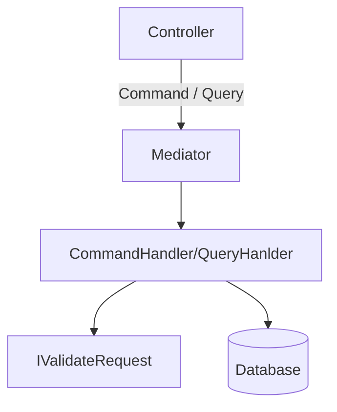
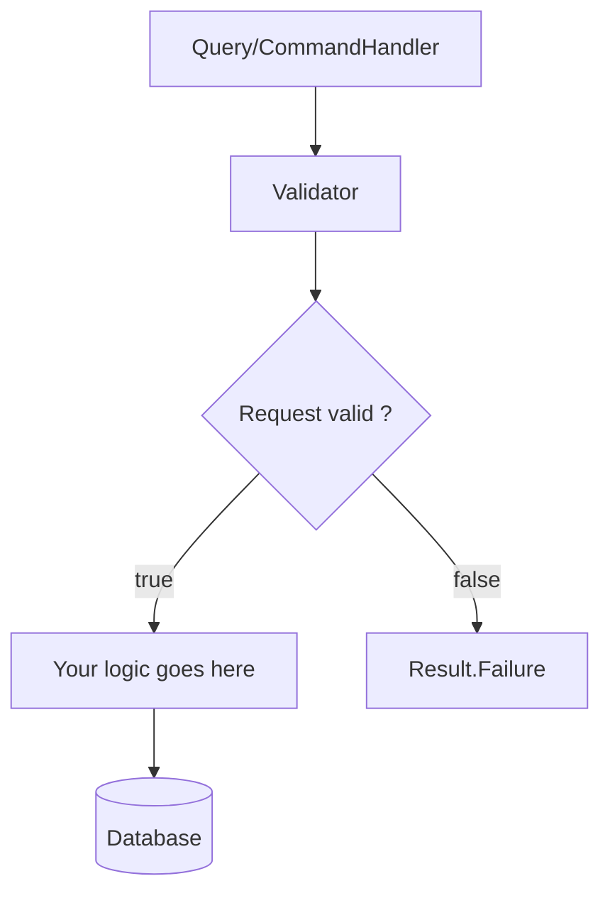

# De urgenta - Backend API

[](https://github.com/code4romania/de-urgenta-backend/graphs/contributors) [](https://github.com/code4romania/de-urgenta-backend/commits/master) [](https://opensource.org/licenses/MPL-2.0)

**Check out the [Wiki](https://github.com/code4romania/de-urgenta-backend/wiki)!**

De Urgență [was prototyped](https://civiclabs.ro/ro/solutions/stay-together) in [Code for Romania](https://code4.ro/ro)'s research project, [Civic Labs](https://civiclabs.ro/ro).

The application aims to inform citizens about how to react to the first critical hours in a crisis situation (like that of an earthquake).

It also aims to build healthy habits that become ingrained with time, so that, when the critical moment arrives, each person knows what the key first steps to keeping themselves safe are. 

## Contributing

This project is built by amazing volunteers and you can be one of them! Here's a list of ways in [which you can contribute to this project](https://github.com/code4romania/.github/blob/master/CONTRIBUTING.md). If you want to make any change to this repository, please **make a fork first**.

If you would like to suggest new functionality, open an Issue and mark it as a __[Feature request]__. Please be specific about why you think this functionality will be of use. If you can, please include some visual description of what you would like the UI to look like, if you are suggesting new UI elements. 

### Programming languages

.NET 5.0 (C#)

### Package managers

NuGet

### Database technology & provider

PostgreSQL

### API endpoints

[Swagger](https://api.deurgenta.hostmysite.ro/swagger/index.html)

## Repos and projects

[Android repo](https://github.com/code4romania/de-urgenta-android)   
[iOS repo](https://github.com/code4romania/de-urgenta-ios)   
[Web app - frontend](https://github.com/code4romania/de-urgenta-client)   
[Web app - backend](https://github.com/code4romania/de-urgenta-backend)   

## Development Tips

### Get started with docker-compose
1. Navigate to `/src`
2. Copy `.env.example` to `.env`
3. Build images (optional - they will be built in step `4.` if they don't exist)
    ```bash
    docker-compose -p de-urgenta build
    ```
4. Start your containers
    ```bash
    docker-compose -p de-urgenta up -d
    ```
5. Navigate to http://localhost:5040/swagger

> we use `-p de-urgenta` to distinguish this compose project and you can skip it if you want. (it would inherit `src` otherwise - you probably have some of those already running)

> you can also specify a env file at runtime with docker-compose so you don't necessarily need to take step `2.` - more info [here](https://docs.docker.com/compose/environment-variables/#using-the---env-file--option)
### Start a postgres server
```
docker-compose -d up postgres
```

### Creating a EF Core migration 
```
dotnet ef migrations add <Migration-name> --project DeUrgenta.Domain --startup-project DeUrgenta.Api --context DeUrgentaContext
```
### Adding EF Core migration to User.Api
```
DeUrgenta.User.Api> dotnet ef migrations add <Migration-name> --startup-project ..\DeUrgenta.Api\ -o Domain\Migrations --context UserDbContext
```
### Backend flows



### Configuring storage
In order to store certification photos you will need to have either Local or S3 storage configured. Toggle between these two options by setting the *StorageService* app setting to the appropriate value.

Local storage needs no additional configuration. This option is suitable for development environments.

S3 storage requires having an [AWS account configured](https://docs.aws.amazon.com/sdk-for-java/v1/developer-guide/setup-credentials.html), a bucket created and the following app settings:
```
"S3ConfigOptions": {
    "BucketName": "your-bucket-name",
    "PresignedUrlExpirationInMinutes": "10"
  }
```

### Using DB checkpoint for integration tests
To configure a DB to be cleaned after integration tests are run you can enable the *UseDbCheckpoint* option in the appsettings.testing.json
```
 "UseDbCheckpoint" : "true"
```

## Feedback

* Request a new feature on GitHub.
* Vote for popular feature requests.
* File a bug in GitHub Issues.
* Email us with other feedback contact@code4.ro

## License

This project is licensed under the MPL 2.0 License - see the [LICENSE](LICENSE) file for details

## About Code for Romania

Started in 2016, Code for Romania is a civic tech NGO, official member of the Code for All network. We have a community of around 2.000 volunteers (developers, ux/ui, communications, data scientists, graphic designers, devops, it security and more) who work pro-bono for developing digital solutions to solve social problems. #techforsocialgood. If you want to learn more details about our projects [visit our site](https://www.code4.ro/en/) or if you want to talk to one of our staff members, please e-mail us at contact@code4.ro.

Last, but not least, we rely on donations to ensure the infrastructure, logistics and management of our community that is widely spread across 11 timezones, coding for social change to make Romania and the world a better place. If you want to support us, [you can do it here](https://code4.ro/en/donate/).
